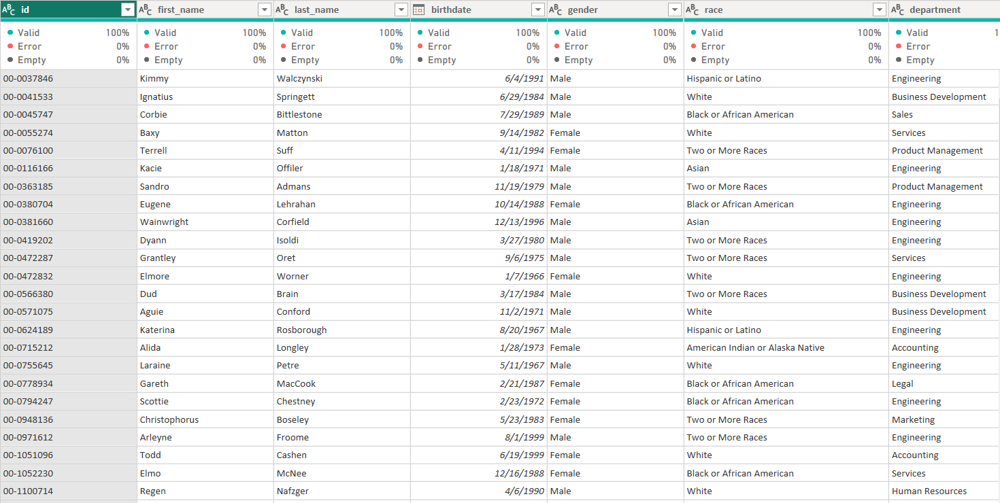
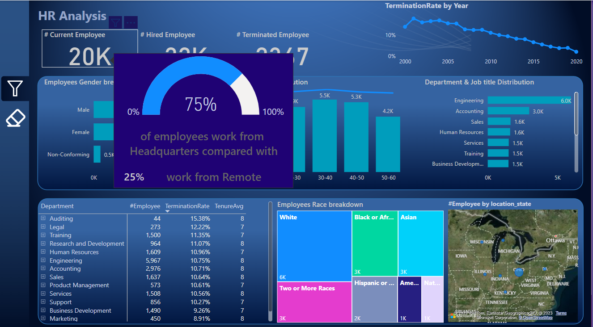
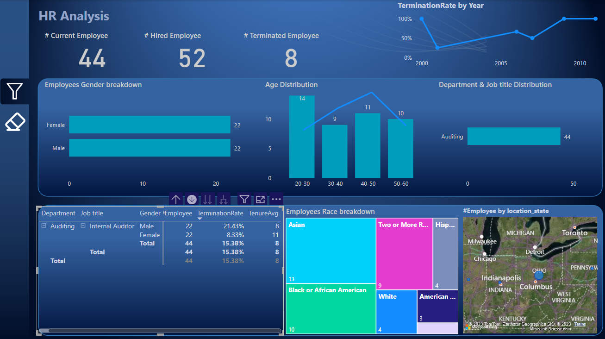

# BI_HR_Analysis
Power_BI_in_HumanResources_Analysis 

# Power_BI_in_Sales_Analysis
Power_BI_in_Sales_Analysis 

## Introduction
This project is to display Human resources Analysis using POWER BI. The problem satatement is an imaginary case scenario I thought about after seeing the dataset.

## Problem Statement
Our client a leading multinational corporation has been experiencing some puzzling trends in their employee turnover rates they suspect that there may be hidden factors causing valuable employees to leave.
As data master it’s our job to dig deep into their HR data and uncover the truth.

Creating one a Human resource dynamic report which answer the following questions:
1. What is the gender breakdown of current employees in the company?
2. What is the race breakdown of current employees in the company? 
3. What is the age  distribution of the current employees in the company?
4. What is the percentage of employees works on Headquarter vs Remote?
5. What is the average length of employement who have been termenated?
6. How does the gender distribution vary across department and job titles?
7. what is the distribution of the job titles across the company?
8. Which department has the highest termination rate?
9. What is the employee distribution across the location state?
10. How has the company employees count changed over time based on hirdate and termination date?
11. What is the tenure distribution for each department?

## Data Sourcing
 the information was in one table:
- hr

Data was then locally extracted from Excel Workbook into Power BI for transformation, analysis and visualization.

## Data Transformation

Data cleaning was performed.
The table appeared to be clean.
The quality of each column is 100% with no error or nulls.
Below is a preview of the tables:

     

**HT Table**

For the HR Table, first rows were not headers and so resolved that by applying the "Use First row as header" action.
Change birthdate,hirdate,termdate to date date type
calculate age column.

## Data Model Design
The data required for this analysis are located in one tables.
However, date table was created using DAX and appropriate modelling is applied.
hr  Table has been modelled with:
- Date Table using the "hire_date"
- Date Tables via "Date"

## Data Aanalysis/ Visualization
Analysis was done using simple visuals since the tables have been perfectly modelled together.
Applied some Dax Function to get the required information

## HR analysis

#### Company has about 20K employee with 75% work from headquarter compared with 25% work remotely.
#### termination rate highly decresing since 2000 to 2020.

#### Audting department had the highest termination rate over than 15%, due to termination rate in men gender more than 21%,
also age group '40-50' on highest termination rate over than 26%. 

## Conclusions/Recommendations
- Over all termination rate had decreased 2000 to 2020.
- Have to study the reason of employee termination in audting departoment.
------

###### My goal is to provide value to the stakeholders and not just to build reports and dashboard. 

Thank you.

